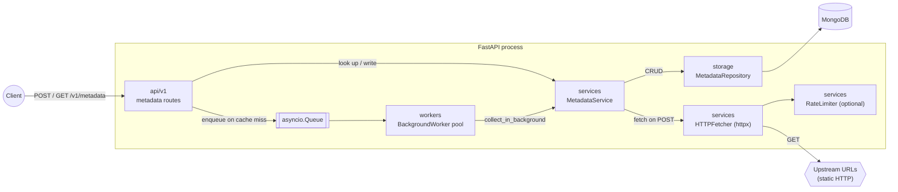

# HTTP Metadata Inventory

A small FastAPI service that collects HTTP **headers, cookies, and page source** for arbitrary URLs and stores them in MongoDB. Cache misses on `GET` are resolved asynchronously by an in-process worker pool so the API stays responsive.

## Features

- `POST /v1/metadata` &mdash; synchronously fetch & persist a URL.
- `GET  /v1/metadata?url=...` &mdash; cache-first lookup. On a miss, the service replies `202 Accepted` and schedules collection in the background.
- **`GET /v1/metadata?url=...&max_age=<seconds>`** &mdash; staleness control: completed records older than `max_age` are re-fetched in the background.
- Background collection is orchestrated entirely **in-process** with an `asyncio.Queue` plus a configurable consumer pool — no broker, no service-to-self HTTP calls.
- **Pending records left over from a previous run are re-enqueued on startup** so an unclean restart doesn't strand work.
- **SSRF guard** rejects URLs whose host resolves to a private / loopback / link-local / multicast / unspecified address. Configurable via env vars.
- **Streaming body-size cap** (`FETCH_MAX_BODY_BYTES`) protects the worker from oversized or malicious responses.
- **Structured (JSON) logging + per-request `X-Request-ID` middleware** so a single request can be traced across the sync handler and the background worker.
- Resilient Mongo connection (retry loop on startup), shared `httpx.AsyncClient`.
- Pluggable per-domain rate-limiter hook (off by default).
- Pydantic v2 models, type-hinted throughout.
- Comprehensive `pytest` suite using `mongomock-motor` and `respx`, **plus a real-Mongo CI job** for parity with production.

## Architecture




`POST` is synchronous: the route handler calls `MetadataService.create`, which fetches and persists in-line. `GET` is cache-first; on a miss it inserts a `pending` placeholder atomically, pushes a job onto the in-process queue, and returns `202`. The worker pool drains the queue and writes the final record so subsequent `GET`s are immediate.

## Project layout

```
app/
├── api/
│   ├── deps.py              # FastAPI dependency providers
│   ├── middleware.py        # X-Request-ID middleware
│   └── v1/
│       ├── health.py        # /healthz, /livez
│       ├── metadata.py      # POST / GET endpoints
│       └── router.py        # aggregate v1 router
├── core/
│   ├── config.py            # pydantic-settings configuration
│   ├── logging.py           # plain + JSON formatters
│   └── request_context.py   # contextvars slot for the request id
├── db/
│   └── mongo.py             # Motor client lifecycle
├── models/
│   └── schemas.py           # Pydantic models (API + persistence)
├── storage/
│   └── metadata.py          # Mongo CRUD for metadata documents (MetadataRepository)
├── services/
│   ├── fetcher.py           # httpx-based fetcher (streaming, capped)
│   ├── metadata_service.py  # service-layer orchestration
│   ├── rate_limiter.py      # per-domain concurrency hook
│   ├── url_security.py      # SSRF guard (DNS-based)
│   └── url_utils.py         # URL normalisation
├── workers/
│   └── background.py        # in-process async worker pool
└── main.py                  # FastAPI app + lifespan wiring

tests/
├── unit/                    # url-utils, repository, fetcher, worker, service,
│                            # rate-limiter, url-security, lifespan-resume
└── integration/             # full app via httpx ASGITransport
```

## Running with Docker Compose

```bash
docker compose up --build
```

The API listens on `http://localhost:8000` and the Mongo container on `localhost:27017`. The service waits for Mongo's health check before it starts. The API container runs as an unprivileged `app` user (see `docker/Dockerfile`).

- Swagger UI: [http://localhost:8000/docs](http://localhost:8000/docs)
- OpenAPI:    [http://localhost:8000/openapi.json](http://localhost:8000/openapi.json)
- Health:     [http://localhost:8000/healthz](http://localhost:8000/healthz)

### Example requests

```bash
# Synchronously collect and store metadata.
curl -X POST http://localhost:8000/v1/metadata \
     -H 'Content-Type: application/json' \
     -d '{"url": "https://example.com"}'

# First GET for a new URL returns 202 + a pending record.
curl -i "http://localhost:8000/v1/metadata?url=https://example.org"

# A follow-up GET (after the worker finishes) returns 200 + the full payload.
curl -s "http://localhost:8000/v1/metadata?url=https://example.org" | jq .
```

## Local development

Requires **Python 3.11+** (see `pyproject.toml`).

```bash
# On macOS the binary is `python3` (or `python3.11`); on Linux distros that
# also expose `python` either form works.
python3 -m venv .venv && source .venv/bin/activate
pip install -r requirements-dev.txt

# Mongo can be run locally via the docker-compose service or any other way.
export MONGO_URI=mongodb://localhost:27017
uvicorn app.main:app --reload
```

### Configuration

All settings come from environment variables (a `.env` file is honoured in local development). Defaults live in `app/core/config.py`; see `.env.example` for the full list:


| Variable                           | Default                       | Notes                                                                    |
| ---------------------------------- | ----------------------------- | ------------------------------------------------------------------------ |
| `MONGO_URI`                        | `mongodb://localhost:27017`   | Connection string                                                        |
| `MONGO_DB`                         | `metadata_inventory`          | Database name                                                            |
| `MONGO_COLLECTION`                 | `metadata`                    | Collection name                                                          |
| `API_HOST` / `API_PORT`            | `0.0.0.0` / `8000`            | Uvicorn bind                                                             |
| `LOG_LEVEL`                        | `INFO`                        |                                                                          |
| `LOG_FORMAT`                       | `plain`                       | `plain` for human logs, `json` for structured logs                       |
| `FETCH_TIMEOUT_SECONDS`            | `10`                          | Per-request timeout                                                      |
| `FETCH_MAX_REDIRECTS`              | `5`                           |                                                                          |
| `FETCH_USER_AGENT`                 | `http-metadata-inventory/0.1` |                                                                          |
| `FETCH_PER_DOMAIN_CONCURRENCY`     | `0`                           | `0` disables throttling; `>=1` caps in-flight requests per host          |
| `FETCH_MAX_BODY_BYTES`             | `5242880` (5 MiB)             | Streaming hard cap; oversized responses raise `FetchError`               |
| `FETCH_BLOCK_PRIVATE_NETWORKS`     | `true`                        | Reject hosts that resolve to private / loopback / link-local IPs (SSRF)  |
| `FETCH_BLOCKED_HOSTS`              | _empty_                       | Comma-separated hostnames that are refused outright                      |
| `WORKER_CONCURRENCY`               | `2`                           | Background consumer pool size                                            |
| `WORKER_QUEUE_MAXSIZE`             | `1000`                        | Bounded queue capacity                                                   |
| `WORKER_RESUME_PENDING_ON_STARTUP` | `true`                        | Re-enqueue `pending` documents from previous runs when the process boots |


## Data model

Each document in `metadata_inventory.metadata` is keyed by the **normalised URL** so different casings/ports of the same address collapse to one record.

```jsonc
{
  "_id": "https://example.com/",
  "url": "https://example.com",
  "status": "completed",          // pending | completed | failed
  "http_status": 200,
  "headers": { "...": "..." },
  "cookies": [{ "name": "...", "value": "...", "domain": "...", "path": "/" }],
  "page_source": "<!doctype html>...",
  "error": null,
  "attempts": 1,
  "created_at": "...",
  "updated_at": "...",
  "fetched_at": "..."
}
```

A compound index on `(status, updated_at)` is created at startup to keep status-aware queries efficient as the dataset grows. `_id` itself is the primary unique key, which is the hot lookup path.

## How the background workflow works

1. `GET /v1/metadata` calls `MetadataService.get_or_schedule`.
2. If a **completed** record exists (and `max_age` does not treat it as stale), the handler returns `200` with the full payload. A **`failed`** record also returns `200` so clients can read `error` without polling `202` forever. A **`pending`** record returns `202` with a slim acknowledgement (no body/headers yet).
3. On a miss (no document) or a stale completed record (when `max_age` is set), a `pending` placeholder is inserted or updated atomically and a `FetchJob` is pushed onto an `asyncio.Queue`. The API responds with `202 Accepted` for the in-flight / scheduled case — no waiting on the fetch.
4. A pool of consumer tasks (`WORKER_CONCURRENCY`) drains the queue,
   invokes the fetcher, and stores the final result (or a `failed`
   record with the error) via the repository.
5. Subsequent `GET`s for the same URL hit the cache once the worker has written a `completed` (or `failed`) record.

The worker pool dedupes in-flight URLs, so a burst of concurrent requests for an uncached URL only triggers a single outbound fetch.

If the process is restarted while a fetch was in flight, the affected URLs would normally remain `pending` forever (the queue is in-memory). On startup, `_resume_pending_jobs` queries Mongo for any `status="pending"` documents and re-submits them to the worker, providing a soft "at-least-once" recovery without an external broker. Disable via `WORKER_RESUME_PENDING_ON_STARTUP=false`.

## Staleness control

By default, a `completed` record is served forever. Callers can opt in to revalidation per request:

```bash
# Return the cached record only if it was updated in the last 5 minutes;
# otherwise re-collect in the background and return 202.
curl -i "http://localhost:8000/v1/metadata?url=https://example.org&max_age=300"
```

When `max_age` triggers a refresh, the existing document is flipped back to `pending` in MongoDB. Previous `headers` / `page_source` / etc. are **left in the document** until the worker overwrites them on success (so the stored record is not blank mid-refresh). The HTTP response is still **`202`** with the slim acknowledgement model — clients do **not** receive the old cached body in that response; they should retry `GET` after the worker finishes.

## SSRF guard

Because the service fetches arbitrary user-supplied URLs, it ships with a DNS-based SSRF guard (enabled by default). Before any request leaves the process, the target host is resolved and rejected if it lands in a private (RFC1918, ULA), loopback, link-local, multicast, or unspecified range. Specific hostnames can also be denied via `FETCH_BLOCKED_HOSTS`.

The IANA "reserved" classification is deliberately *not* in the deny list because it includes the NAT64 well-known prefix (`64:ff9b::/96`, RFC 6052), which is how dual-stack and IPv6-only networks reach public IPv4 services. Blocking it would break legitimate egress on a modern Docker host.

This is best-effort (DNS can change between check and connect — a classic TOCTOU). For full coverage, run the service behind an egress firewall or a custom `httpx` transport that re-validates the resolved IP just before the TCP connect.

## Observability

- Every response includes an `X-Request-ID` header (echoed back if the client supplied one). The same id is bound to a `contextvars` slot and emitted in every log record, including those produced by the background worker.
- Set `LOG_FORMAT=json` to emit one JSON object per line — drop-in friendly for Datadog, Loki, CloudWatch, etc.

## Testing

```bash
pip install -r requirements-dev.txt
pytest
```

- **Unit tests** cover URL normalisation, repository semantics, the fetcher (against a `respx`-mocked transport), the worker pool, the service layer, the SSRF guard, the rate limiter, and the startup pending-resume hook.
- **Integration tests** mount the real FastAPI app via `httpx.ASGITransport`, with `mongomock-motor` as the database and a deterministic fake fetcher, so end-to-end flows (POST then GET, miss then background fill, `max_age` refresh, request-ID echo) are validated without network access.
- **CI also runs the suite against a real MongoDB 7 service container**, so the parts of the repository that rely on real driver semantics (`DuplicateKeyError` on duplicate `_id`, `find_one_and_update` upserts, async cursors) are exercised on the production driver as well.

### Linting & formatting

The project uses [ruff](https://docs.astral.sh/ruff/) for both linting and formatting (config lives in `pyproject.toml`):

```bash
ruff check .         # lint
ruff format .        # format
ruff check --fix .   # auto-fix lint violations
```

## Extensibility notes

- The `BackgroundWorker` can be swapped for a Celery/RQ/Arq backend by re-implementing the `JobHandler` contract - the rest of the codebase is unchanged.
- The repository is the only Mongo-aware module; switching to another document store would only require replacing it.
- The `MetadataService` is fully isolated from FastAPI, making it easy to invoke from CLI commands, batch jobs, or other transports.
- `app.services.rate_limiter.RateLimiter` is a `Protocol`; a token-bucket or Redis-backed limiter can be dropped in without touching the fetcher.

## Trade-offs & Limitations

This service is intentionally scoped to the challenge brief.  A few explicit limitations and the upgrade paths for each:

- **In-process worker, soft at-least-once.** Jobs in the `asyncio.Queue` are lost on restart. The `_resume_pending_jobs` startup hook recovers any document still in `pending`, which closes the durability gap for the common case, but a job that was *just dequeued* when the process crashed has no breadcrumb to recover from. For real at-least-once semantics or multi-node deployments, swap the worker for an external broker (Celery/RQ/Arq); the `JobHandler` contract is the only seam that needs to change.
- **Page source is stored inline.** Fine for typical HTML and already capped by `FETCH_MAX_BODY_BYTES`. A future iteration could push the body to object storage (S3/GCS) and keep only a pointer in Mongo to keep documents small and lookups fast.
- **Rate limiting is per-process, concurrency-only.** The included `PerDomainSemaphoreLimiter` caps in-flight requests per host but does *not* enforce req/sec throughput, and the state lives in memory. Production crawlers should add a token-bucket and back the state with Redis or a similar shared store.
- **SSRF guard is DNS-based.** The check happens before the request and resolves the host to one or more IPs; if the resolver lies between check and connect (TOCTOU), an attacker could still reach an internal address. Combine with an egress firewall or a custom `httpx` transport that re-validates the resolved IP at connect time for full coverage.
- **No retry/backoff on transient failures.** A 5xx from upstream is recorded as a `failed` document; the `attempts` field is incremented but the worker does not automatically retry. A small "retry on `failed` if `attempts < N` and last failure was >= X seconds ago" sweeper would close the gap.
- **No authentication or authorisation.** Out of scope for the challenge; the API trusts all callers. A real deployment should front this with an API gateway or add an auth dependency.
- **JavaScript rendering is intentionally unsupported.** Per the brief, the service captures the *static* HTTP response. Sites that render client-side (Single Page Apps) will yield a near-empty `page_source`. Adding a headless-browser fetcher behind the same `HTTPFetcher`-shaped interface is the obvious upgrade path.
- **No request-level metrics or tracing.** Logs are now structured (`LOG_FORMAT=json`) and tagged with a per-request id, but there are no Prometheus/OpenTelemetry hooks yet. Add `prometheus-fastapi-instrumentator` (or equivalent) when needed.

